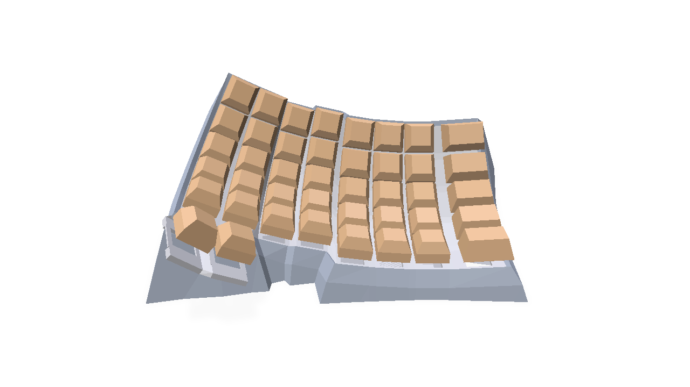

# dactyl_manuform_keyboard_generator_Python

This is a fork of the Dactyl Manuform keyboard generator by joshreve: https://github.com/joshreve/dactyl-keyboard
This code should be slightly more organized and easier to use. In progress

# Status



# How to use

Requires Python 3.13+ and [uv](https://docs.astral.sh/uv/). Dependencies are managed through `pyproject.toml` / `uv.lock`, so there is nothing to install manually:

```
uv run dactcreate.py
```

uv creates the virtual environment, fetches the pinned Python version and all packages on first run. This will generate a bunch of step files in /things

Modify dactcreate.py to your liking to get to the exact keyboard STEP file that you want. 

Modify these lines to configure your keyboard. 
conf1 = dactylutils.Dact.Config(show_caps   = True,
                                script_print_shapes = True,
                                 nrows      = 5,
                                 ncols      = 6,
                                 )

You can find more configuration options under the Config @dataclass in the dactultils.py file. 

GNU AFFERO GENERAL PUBLIC LICENSE Version 3, 19 November 2007