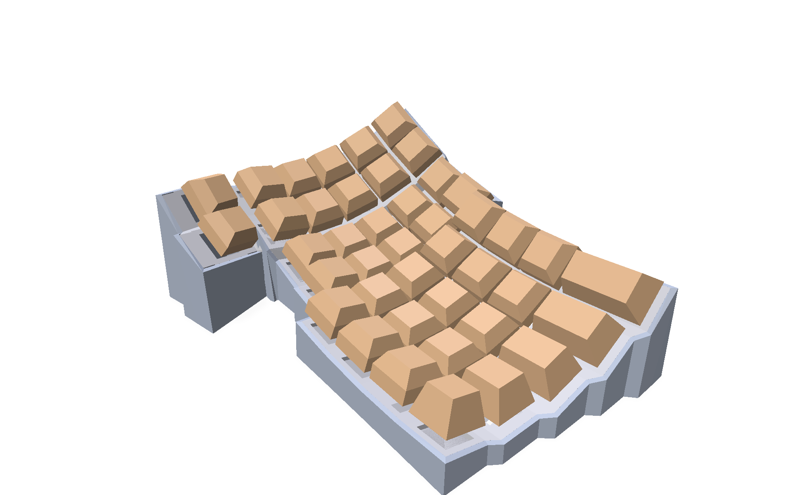
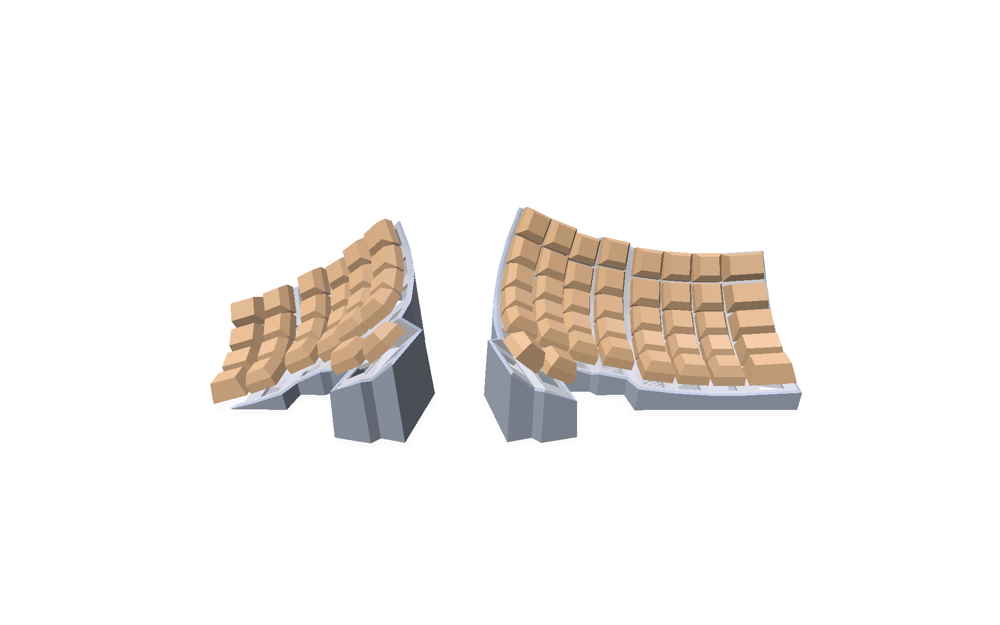
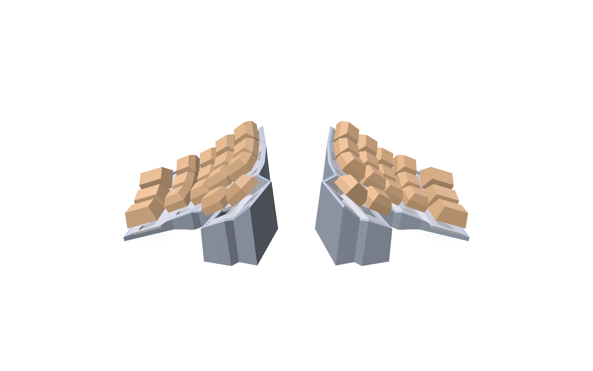
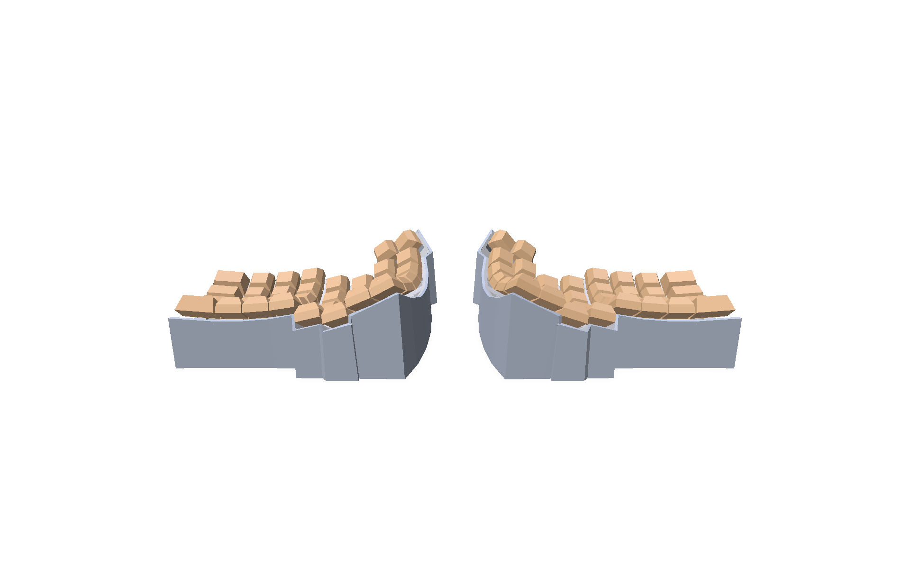
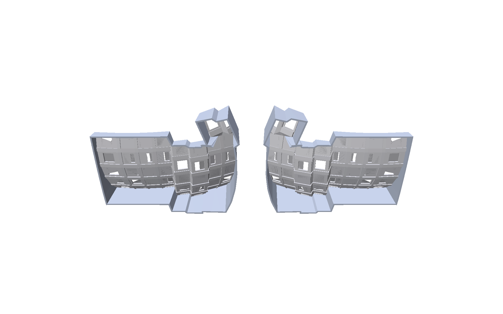

# dactyl_manuform_keyboard_generator_Python

This is a fork of the Dactyl Manuform keyboard generator by joshreve: https://github.com/joshreve/dactyl-keyboard
This code should be slightly more organized and easier to use. In progress

# Status

Both halves with the default configuration (6 rows, 8 columns), rendered live in the GUI:


# Examples

All of these were configured with the sliders in the live GUI and rendered there.

Pinky column width set per row, tapering from 34 mm at the back to 19 mm at the front:



Halves configured independently, each with its own sliders (left: 5 rows x 6 columns with 30 degree tenting, right: 6 rows x 8 columns):



Compact variant (4 rows, 5 columns, 25 degree tenting):



The case seen from the back: the walls have a single uniform thickness, follow the plate edges, and wrap around the thumb cluster:



The underside (keycaps hidden): the case is a hollow shell of key plates and walls, with the switch holes visible from inside:



# How to use

Requires Python 3.13+ and [uv](https://docs.astral.sh/uv/). Dependencies are managed through `pyproject.toml` / `uv.lock`, so there is nothing to install manually; uv creates the virtual environment, fetches the pinned Python version and all packages on first run.

## Live preview GUI

```
uv run dactylgui.py
```

Opens a 3D viewer with sliders for rows, columns, curvature, tenting, thumb key placement, wall thickness and more. The model rebuilds in about 50 ms on every slider change, so it follows the sliders live.

- Both halves are shown. By default they mirror each other and one set of sliders drives both; uncheck "Mirror halves" to configure each half independently with its own sliders.
- The pinky column width can be one value for all rows or set per row (uncheck "Same pinky width for all rows").
- Use the buttons to export both halves as STL (instant, from the mesh pipeline) or STEP (slower, through CadQuery).

## STEP file generation

```
uv run dactcreate.py
```

Generates the keyboard STEP files in /things. Modify dactcreate.py to your liking to get to the exact keyboard STEP file that you want:

    conf1 = dactylutils.Dact.Config(show_caps = True,
                                    nrows     = 5,
                                    ncols     = 6,
                                    )

You can find more configuration options under the Config @dataclass in the dactylutils.py file.

# Architecture

There are two geometry pipelines that share the same layout math (the point functions in `dactylutils.py`), so they always produce the same keyboard:

- `dactylmesh.py` builds triangle meshes with [manifold3d](https://github.com/elalish/manifold). Mesh booleans and convex hulls take milliseconds, which is what makes the live GUI possible. Also used for STL export.
- `dactylutils.py` builds B-rep solids with [CadQuery](https://github.com/CadQuery/cadquery) / OCCT. Slower, but produces proper CAD data (STEP) for further work in CAD programs.

# License

Copyright (C) 2015-2026 Matthew Adereth, Tom Short, Joshua Shreve, and Georges Paul.

The source code is distributed under the GNU Affero General Public License Version 3 (see [LICENSE](LICENSE)), inherited from the dactyl-keyboard projects this is derived from.
